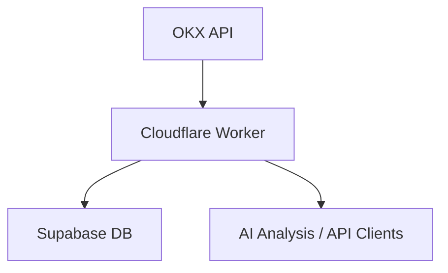

# Short Gainers Screener

一个基于 Cloudflare Worker + Supabase 的加密货币数据采集系统，用于筛选“涨幅榜做空”候选标的，并为 AI 分析提供结构化数据。

---

## 🚀 项目目标

该系统用于：

- 获取 OKX 涨幅榜（Top Gainers）
- 获取多周期 K线数据
- 计算基础指标（rolling high / low）
- 存储到 Supabase
- 提供统一 JSON 数据结构

⚠️ 本项目仅做数据采集与处理，不涉及交易。

---

## 🧱 系统架构


## 🏗️ 系统架构

1.  **data-fetcher**: 对接 OKX API，获取行情与 K 线（带并发控制）。
2.  **data-processor**: 计算技术指标（滚动窗口最高/最低价）。
3.  **storage-layer**: 数据持久化至 Supabase。
4.  **api-layer**: 提供标准化数据查询接口。

---

## 📦 功能模块

### 1. 数据采集
- 获取涨幅榜（24h）
- 获取 K线数据：
  - 5m, 15m, 1h, 4h, 1d

---

### 2. 数据处理
- 统一 JSON 结构
- 计算 rolling high/low（滚动窗口价格）

---

### 3. 数据存储
使用 Supabase (PostgreSQL) 存储：
- `symbols`
- `klines`
- `market_data`
- `indicators`

---
## 📖 API 接口文档

### 1. 触发数据抓取 (Cron/Manual)
`GET /api/cron-fetch`
- **说明**: 触发全量抓取流程：获取涨幅榜 -> 抓取 K 线 -> 计算指标 -> 存入数据库。
- **用途**: 建议配置为 Cloudflare Worker 的 Scheduled Trigger 或定时调用。

### 2. 获取涨幅榜
`GET /api/gainers`
- **说明**: 获取当前数据库中缓存的涨幅榜币种及其基础行情。

### 3. 获取 K 线数据
`GET /api/klines?symbol=BTC-USDT&timeframe=1h`
- **说明**: 获取指定币种和周期的结构化数据（含 Rolling High/Low）。

---
## ⚙️ 环境配置

在 `.env` 或 Worker Settings 中配置：

| 变量名 | 必填 | 说明 |
| :--- | :--- | :--- |
| `OKX_BASE_URL` | 是 | OKX API 地址 (默认 https://www.okx.com) |
| `SUPABASE_URL` | 是 | Supabase 项目地址 |
| `SUPABASE_ANON_KEY` | 是 | Supabase 匿名 Key |
| `TOP_N` | 否 | 抓取涨幅榜前 N 名 (默认 50) |
| `MIN_CHANGE_PERCENT` | 否 | 最小涨幅百分比 (默认 3) |
| `TIMEFRAMES` | 否 | 周期列表 (默认 5m,15m,1h,4h,1d) |
| `ROLLING_WINDOW` | 否 | 指标计算窗口 (默认 50) |

---

## 🛠️ 本地开发与部署

```bash
# 1. 安装依赖
npm install

# 2. 数据库初始化
# 将 supabase/schema.sql 的内容运行在 Supabase SQL Editor 中

# 3. 本地预览
npm run dev

# 4. 部署
npx wrangler deploy
```
