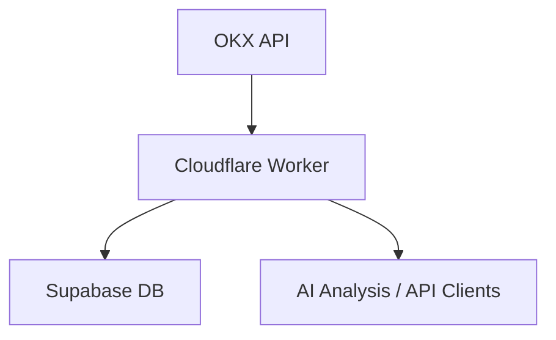

# Short Gainers Screener

一个基于 Cloudflare Worker + Supabase 的加密货币数据采集系统，用于筛选“涨幅榜做空”候选标的，并为 AI 分析提供结构化数据。

---

## 🚀 项目目标

该系统用于：

- 获取 OKX 涨幅榜（Top Gainers）
- 获取多周期 K线数据
- 计算基础指标（rolling high / low）
- 存储到 Supabase
- 提供统一 JSON 数据结构

⚠️ 本项目仅做数据采集与处理，不涉及交易。

---

## 🧱 系统架构



---

## 📦 功能模块

### 1. 数据采集
- 获取涨幅榜（24h）
- 获取 K线数据：
  - 5m, 15m, 1h, 4h, 1d

---

### 2. 数据处理
- 统一 JSON 结构
- 计算 rolling high/low（滚动窗口价格）

---

### 3. 数据存储
使用 Supabase (PostgreSQL) 存储：
- `symbols`
- `klines`
- `market_data`
- `indicators`

---

## ⚙️ 环境配置

在 Worker 的 `env` 中配置：
- `OKX_BASE_URL`
- `SUPABASE_URL`
- `SUPABASE_ANON_KEY`
- `FETCH_LIMIT`
- `ROLLING_WINDOW`

---

## 🧪 本地开发

```bash
npm install
npm run dev
```

---

## 🛠️ 部署

```bash
npx wrangler deploy
```
